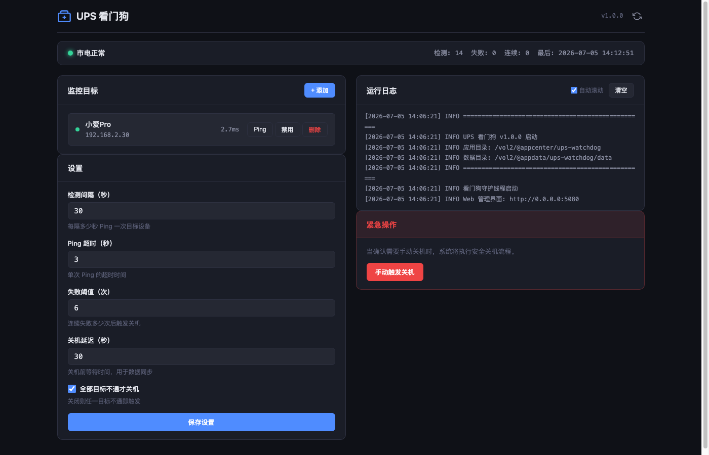

<p align="center">
  
</p>

<h1 align="center">UPS 看门狗</h1>

<p align="center">
  <strong>飞牛 fnOS 非智能 UPS 断电保护方案</strong><br />
  通过 Ping 局域网设备检测市电状态，断电时自动安全关机，保护硬盘和数据安全。
</p>

<p align="center">
  <a href="https://github.com/rboyy/fnos_ups/releases"></a>
  <a href="https://github.com/rboyy/fnos_ups/blob/main/LICENSE"></a>
  <a href="https://rboyy.github.io/"></a>
</p>

---

## 为什么需要这个？

很多 NAS 用户配备了非智能 UPS（无 USB/网络通讯接口），停电时 UPS 只能撑一段时间，NAS 却不知道市电已断，一旦 UPS 耗尽就会突然断电——轻则丢数据，重则伤硬盘。

**UPS 看门狗**用一种巧妙的思路解决这个问题：停电时路由器也会断电，所以只要 Ping 路由器（或其他局域网设备），不通了就说明停电了，自动执行安全关机。零成本、零硬件改造，纯软件搞定。

## 功能特性

- **Ping 轮询检测** — 定时 Ping 一个或多个局域网设备（路由器、交换机、摄像头等），全部不通即判定断电
- **Web 管理界面** — 暗色主题仪表盘，实时监控状态、管理目标、调整参数、查看日志
- **多目标监控** — 支持添加多个监控目标，可单独启用/禁用，支持「全部失败才关机」或「任一失败即关机」两种策略
- **灵活配置** — 检测间隔、Ping 超时、失败阈值、关机延迟均可自定义
- **手动关机** — 提供紧急手动关机按钮，方便维护时使用
- **原生应用** — 纯 Python 实现，零外部依赖，打包为飞牛 fnOS 原生 fpk 安装包，无需 Docker
- **安装向导** — 安装时通过向导配置默认监控目标，开箱即用

## 界面预览



## 工作原理

```
  市电正常时                        市电中断时
  ┌─────────┐                      ┌─────────┐
  │  路由器  │ ← Ping 通 ✓          │  路由器  │ ← Ping 不通 ✗
  └─────────┘                      └─────────┘
       ↑                                ↑
  ┌─────────┐                      ┌─────────┐
  │   NAS   │ → 正常运行            │   NAS   │ → 连续N次失败
  └─────────┘                      └─────────┘ → 安全关机！
```

1. 每隔 N 秒 Ping 一次配置的局域网目标设备
2. 如果所有目标连续 M 次不可达，判定市电中断
3. 执行 `sync` 刷盘 → 等待配置的延迟时间 → 执行 `shutdown -h now` 安全关机

## 安装

### 方式一：直接下载 fpk 安装（推荐）

1. 前往 [Releases](https://github.com/rboyy/fnos_ups/releases) 页面下载最新版 `ups-watchdog.fpk`
2. 打开飞牛 fnOS Web 管理界面 → 应用中心 → 右上角「安装本地应用」
3. 选择下载的 fpk 文件，按向导配置监控目标 IP（建议填路由器网关）
4. 安装完成后自动启动，访问 `http://NAS_IP:5080` 进入管理界面

### 方式二：源码打包

```bash
# 克隆仓库
git clone https://github.com/rboyy/fnos_ups.git
cd fnos_ups

# 打包 app.tgz
COPYFILE_DISABLE=1 tar czf app.tgz -C app bin ui www

# 打包 fpk
TMPDIR=$(mktemp -d)
cp app.tgz manifest ICON.PNG ICON_256.PNG "$TMPDIR/"
cp -R cmd config wizard "$TMPDIR/"
COPYFILE_DISABLE=1 tar czf ups-watchdog.fpk -C "$TMPDIR" .
rm -rf "$TMPDIR"
```

## 配置说明

| 参数 | 默认值 | 说明 |
|------|--------|------|
| 检测间隔 | 10 秒 | 每隔多少秒 Ping 一次目标设备 |
| Ping 超时 | 3 秒 | 单次 Ping 的超时时间 |
| 失败阈值 | 6 次 | 连续失败多少次后触发关机 |
| 关机延迟 | 30 秒 | 关机前等待时间，用于数据同步 |
| 全部失败才关机 | 开启 | 开启=所有目标都不通才关机；关闭=任一目标不通即关机 |

**推荐配置**：检测间隔 10 秒 × 失败阈值 6 次 = 连续 60 秒无响应后关机。UPS 续航超过 2 分钟即可保证安全关机。

## 项目结构

```
fnos_ups/
├── app/
│   ├── bin/
│   │   └── main.py           # 主程序（看门狗 + Web 服务器）
│   ├── ui/
│   │   ├── config            # 桌面快捷方式配置
│   │   └── images/           # 应用图标
│   └── www/
│       ├── index.html        # Web 管理界面
│       ├── css/style.css     # 样式
│       └── js/app.js         # 前端逻辑
├── cmd/
│   ├── main                  # 应用生命周期管理（start/stop/status）
│   ├── install_init          # 安装初始化脚本
│   └── install_callback      # 安装向导回调脚本
├── config/
│   ├── privilege             # 权限配置（需 root 执行关机）
│   └── resource              # 资源配置
├── wizard/
│   └── install               # 安装向导表单定义
├── manifest                  # 应用元数据
├── ICON.PNG                  # 应用图标（大）
└── ICON_256.PNG              # 应用图标（256px）
```

## 技术细节

- **纯 Python stdlib**：使用 `http.server` + `threading` + `subprocess`，零外部依赖，不需要 pip install
- **单进程双线程**：主线程运行 HTTP 服务器（端口 5080），守护线程运行 Ping 轮询
- **路径解析**：使用 `os.path.realpath(__file__)` 定位应用目录，兼容 fnOS 的安装路径规范
- **数据持久化**：配置存储在 `/vol2/@appdata/ups-watchdog/data/config.json`，应用重启后自动加载
- **安全关机**：先 `sync` 刷盘，再等延迟时间，最后 `shutdown -h now`

## 常见问题

**Q：为什么选路由器作为监控目标？**
A：路由器和 NAS 通常共用一个电源环境。停电时路由器也会断电，所以 Ping 不通路由器 = 停电了。而且路由器 7×24 在线，不会误判。

**Q：会不会因为网络波动误关机？**
A：默认配置需要连续 6 次（共 60 秒）所有目标都不可达才会触发关机。你也可以添加多个目标（路由器 + 交换机 + 摄像头），进一步降低误判概率。

**Q：关机后 UPS 还有电，来电了 NAS 能自动开机吗？**
A：取决于 NAS 的 BIOS 设置。大多数 NAS 支持设置「来电自动开机」（AC Power Recovery），在 BIOS 中开启即可。UPS 看门狗只负责安全关机，来电后的开机由硬件 BIOS 处理。

**Q：支持其他 NAS 系统吗？**
A：当前打包为飞牛 fnOS 的 fpk 格式。核心逻辑是纯 Python，理论上可以适配任何 Linux NAS 系统，只需要调整打包格式和路径配置。

## 致谢

灵感来源于飞牛社区帖子 [《开发非智能交互UPS自动关机套件》](https://club.fnnas.com/forum.php?mod=viewthread&tid=14656)，感谢原作者的思路。

## 相关链接

- [RBoy 博客](https://rboyy.github.io/) — 作者的个人博客，分享折腾 NAS、Docker、智能家居的心得
- [飞牛 fnOS](https://www.fnnas.com/) — 飞牛 NAS 官方网站
- [飞牛社区](https://club.fnnas.com/) — 飞牛用户交流论坛

## License

[MIT License](LICENSE)
